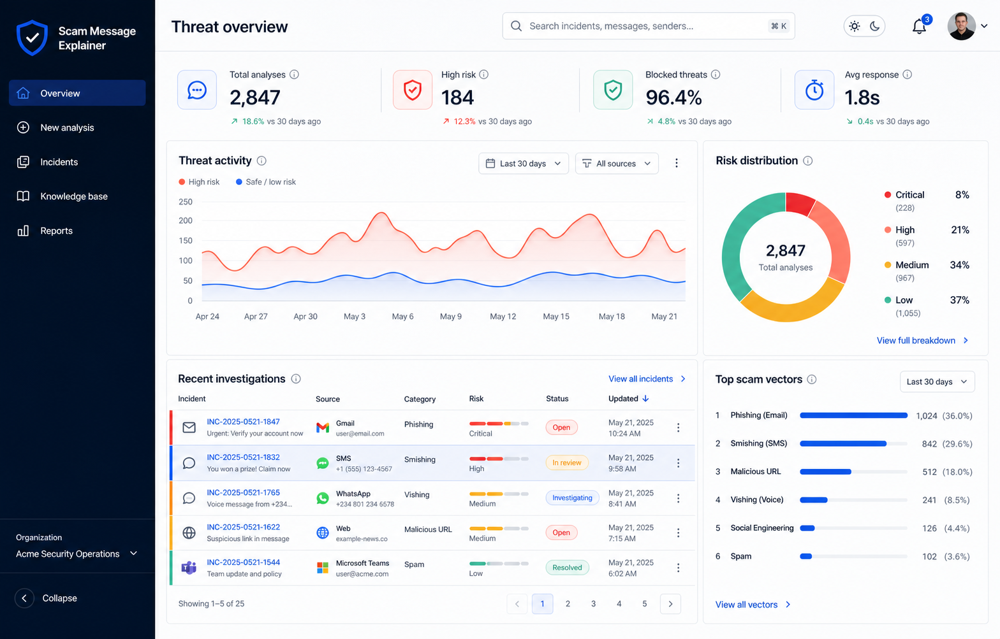

# Scam Message Explainer

A privacy-conscious cybersecurity console for assessing suspicious messages, understanding the warning signs, and choosing a safe next step.



Scam Message Explainer turns an email, SMS, WhatsApp message, social post, or URL into an explainable risk report. Its deterministic rule engine identifies common social-engineering and phishing signals without sending submitted content to an external AI service.

## Highlights

- Analyzes urgency, credential requests, financial lures, suspicious and shortened links, authority impersonation, and risky attachments
- Produces a weighted risk score, threat level, confidence estimate, category, evidence highlights, and plain-language explanation
- Recommends immediate actions, mistakes to avoid, and practical prevention steps
- Includes an operations dashboard, searchable incident register, knowledge center, downloadable reports, and CSV exports
- Supports demo account and plan flows using browser-local state, with no infrastructure required
- Provides light and dark themes, keyboard focus styles, reduced-motion support, and print-friendly reports

## How it works

1. Choose the message source and paste the suspicious content.
2. The `/api/analyze` route validates the request, enforces same-origin submission, and rate-limits it.
3. The analysis service matches explainable indicators and calculates a bounded risk score.
4. The interface presents the evidence and safe response guidance without storing the submitted message.

The included analyzer is intentionally deterministic: every finding can be traced to a visible rule. It is useful for education, demonstrations, and as a foundation for future threat-intelligence integrations.

## Tech stack

- Next.js 15 App Router
- React 19 and TypeScript
- Tailwind CSS and a tokenized design system
- Zod request validation
- Vitest, Testing Library, and Playwright-based visual QA
- Lucide React icons

## Getting started

### Prerequisites

- Node.js 20 or newer
- npm 10 or newer

### Install and run

```bash
git clone https://github.com/maramraboudi/scam-message-explainer.git
cd scam-message-explainer
npm install
npm run dev
```

Open [http://localhost:3000](http://localhost:3000).

No environment variables are required for the built-in rule engine. If you add a server-side provider later, copy the example configuration first:

```bash
cp .env.example .env.local
```

Local `.env` files are ignored by Git. Never put secrets in variables prefixed with `NEXT_PUBLIC_`.

## Available scripts

| Command | Purpose |
| --- | --- |
| `npm run dev` | Start the local development server |
| `npm run build` | Create an optimized production build |
| `npm run start` | Serve the production build |
| `npm run typecheck` | Check TypeScript without emitting files |
| `npm run lint` | Run ESLint with zero warnings allowed |
| `npm test` | Run the automated test suite once |
| `npm run test:ui` | Exercise the rendered demo workflow |

For visual QA, run the production server on port 3100 in one terminal and the test in another:

```bash
npm run build
npm run start -- -p 3100
npm run test:ui
```

The visual test follows the dashboard → demo submission → generated report journey in Microsoft Edge at 1536 × 1024.

## Project structure

```text
src/
├── app/
│   ├── api/analyze/       # Validated, rate-limited API boundary
│   ├── globals.css        # Design tokens and responsive styles
│   ├── layout.tsx         # Metadata and document shell
│   └── page.tsx           # Application entry point
├── components/
│   ├── analyzer.tsx       # Submission and report workflow
│   ├── dashboard.tsx      # Operational overview
│   ├── incidents.tsx      # Investigation register
│   ├── knowledge.tsx      # Awareness content
│   ├── platform.tsx       # Navigation, theme, and orchestration
│   └── ui.tsx             # Shared UI primitives
└── lib/
    ├── analysis.ts        # Side-effect-free analysis service
    ├── data.ts            # Seed and knowledge-base content
    └── types.ts           # Domain contracts
```

Keeping the UI, API boundary, and analysis domain separate makes it possible to add reputation services or threat-intelligence providers without rebuilding the product experience.

## Security and privacy

- Strict Zod schema with an 8–12,000 character input boundary
- HTML entity encoding before evidence highlighting
- Same-origin POST checks to reduce cross-site request forgery risk
- Per-IP request throttling for the demo API
- Content Security Policy, frame denial, MIME-sniffing prevention, referrer policy, COOP, and a restrictive permissions policy
- No logging or persistence of submitted message content
- No database or external analysis provider in the current release

The rate limiter is in memory and the account experience is a browser-local demonstration. A production deployment should use durable distributed rate limiting, managed authentication, HttpOnly sessions, tenant isolation, audit logs, malware scanning, and isolated file/OCR processing.

## Testing

Run the complete local validation suite:

```bash
npm run typecheck
npm run lint
npm test
npm run build
```

Tests cover scoring, category detection, low-risk behavior, output encoding, size limits, API validation, structured responses, cross-origin rejection, product navigation, plan persistence, login validation, incident filtering, and bookmarks.

## Roadmap

- OCR, QR decoding, PDF extraction, and isolated malware scanning
- URL reputation, passive DNS, and threat-intelligence integrations
- Multi-tenant organizations, RBAC, SSO, and immutable audit logs
- Durable incidents, collaboration, assignments, and alert routing
- Localized guidance and jurisdiction-specific reporting
- Calibrated model-assisted classification with provenance and human review
- Distributed rate limiting, queues, observability, and SIEM/SOAR integrations

## Disclaimer

This project provides decision support, not a guarantee that content is safe or malicious. Verify high-impact requests through an independent channel and involve a qualified security professional when appropriate.
